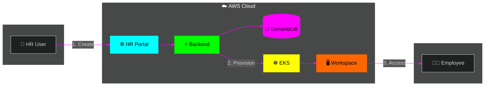
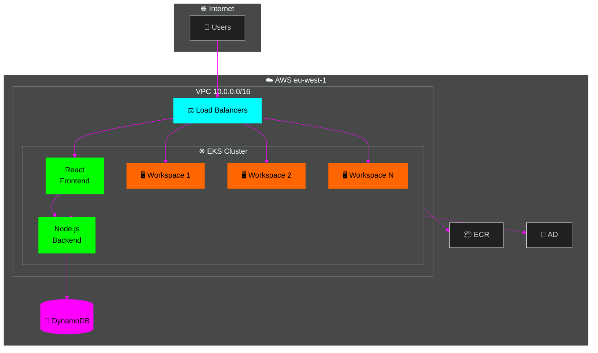
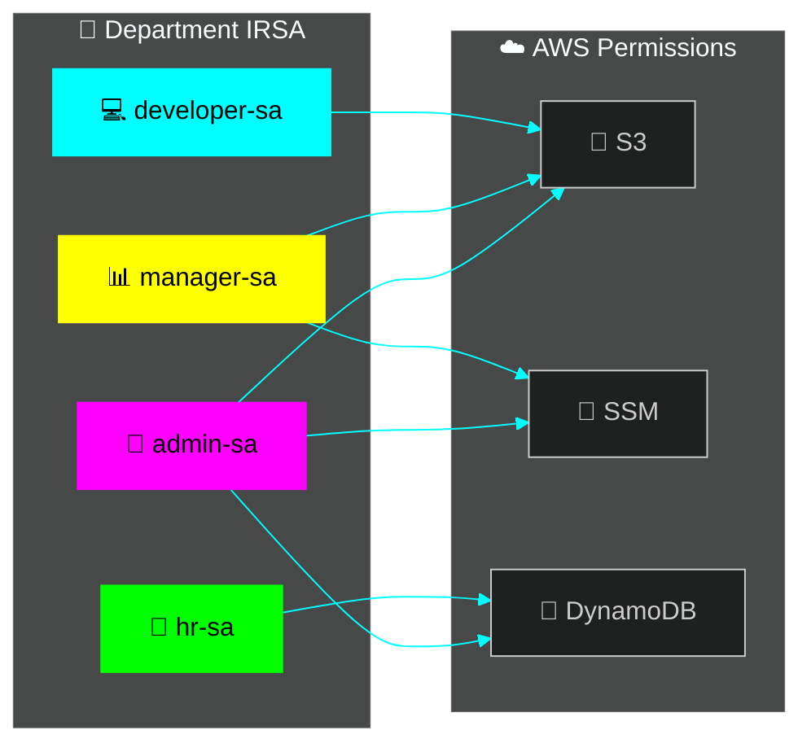

# 🚀 InnovaTech Employee Lifecycle Platform

> **Automated employee onboarding with cloud-native Linux workspaces**

[](https://aws.amazon.com/eks/)
[](https://kubernetes.io/)
[](https://www.terraform.io/)

---

## 📋 Overview

A cloud-native HR platform that **automatically provisions Linux desktop workspaces** for new employees. When HR submits employee details, the system creates a containerized Ubuntu desktop accessible via web browser.



---

## ⚡ Quick Start

### 🌐 HR Portal URL
```
http://ac0cd11d903e646dc890a3606c5999df-8a0c923d8bfa6cfe.elb.eu-west-1.amazonaws.com
```

### 📝 Create Employee Workspace
1. **Employees** → Add Employee (name, email, department, role)
2. **Provision Workspace** → Wait ~2 min
3. **Workspaces** → Open Desktop + copy password

---

## 🏗️ Architecture

📖 **Detailed docs**: [docs/ARCHITECTURE.md](docs/ARCHITECTURE.md)



---

## 🖥️ Workspace Features

| Tool | Description |
|------|-------------|
| 🐧 **Ubuntu 22.04** | Linux desktop via browser |
| 🖼️ **XFCE** | Lightweight desktop |
| 🌐 **Firefox** | Web browser |
| 💻 **Terminal** | xfce4-terminal |
| 🔒 **PuTTY** | SSH client |
| ☁️ **AWS CLI** | Cloud access (IRSA) |

---

## 🔐 Security Model



| Feature | Status |
|---------|--------|
| **IRSA** | ✅ No static credentials |
| **Network Policies** | ✅ Namespace isolation |
| **Private Subnets** | ✅ Pods protected |
| **AD Integration** | ⚠️ Ready (innovatech.local) |

---

## 📁 Project Structure

```
📦 casestudy3
├── 📂 applications/
│   ├── 📂 hr-portal/          # React + Node.js
│   └── 📂 workspace/          # Ubuntu desktop container
├── 📂 kubernetes/             # K8s manifests
├── 📂 terraform/              # AWS infrastructure (IaC)
├── 📂 .github/workflows/      # CI/CD pipeline
└── 📂 docs/                   # Documentation
```

---

## 🛠️ Tech Stack

| Layer | Technology |
|-------|------------|
| ☁️ **Cloud** | AWS (EKS, DynamoDB, ECR, VPC) |
| 🏗️ **IaC** | Terraform |
| 🐳 **Container** | Docker, Kubernetes |
| ⚡ **Backend** | Node.js, Express |
| 🎨 **Frontend** | React |
| 🖥️ **Desktop** | Ubuntu, XFCE, TigerVNC, noVNC |
| 🔄 **CI/CD** | GitHub Actions |

---

## 📊 AWS Resources

| Resource | Value |
|----------|-------|
| **EKS Cluster** | `innovatech-employee-lifecycle` |
| **Region** | `eu-west-1` (Ireland) |
| **VPC** | `10.0.0.0/16` |
| **Directory** | `innovatech.local` |

---

<p align="center">
  <sub>☁️ AWS • ☸️ Kubernetes • 🐳 Docker • 🎓 Fontys S3 2025</sub>
</p>
